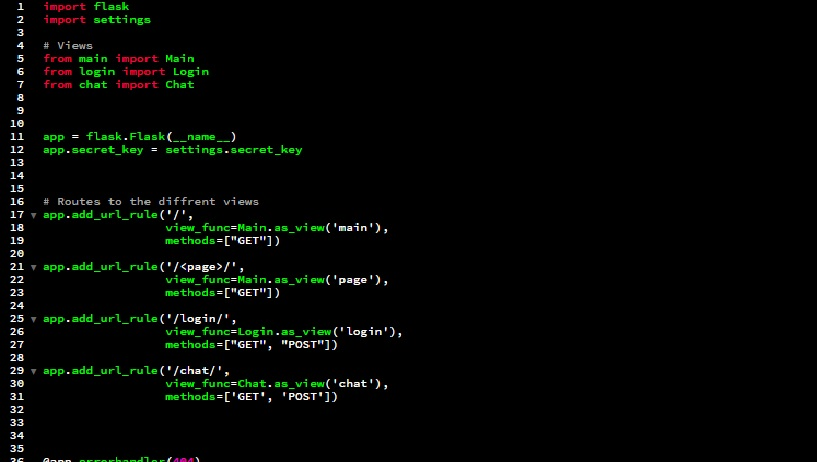
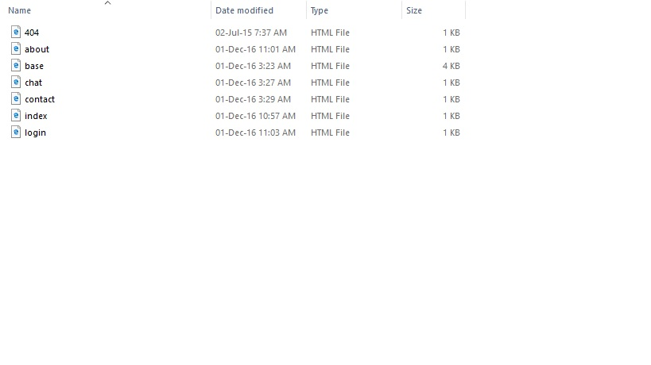

UC-Info
=============

####Built by [Alan Heanue](https://github.com/heanuea)

###The Project

UC-info is a small blog / info service on a how it is to live life with [Ulcerative colitis](https://en.wikipedia.org/wiki/Ulcerative_colitis) 

It will be a single page application with a few links to help you out, there will be a special content 
tab where you submit your email and get a few help tips and other documation. 

UC info Also will have a comment section where you can talk or leave comments to each other .

UC- Info will be made easy to navigate and be very easy to use.

 
Table of Contents
=================

  * [Project overview](#project-overview)
  * [Members](#members)
  * [Prerequisites](#prerequisites)
  * [Installing](#installing)
  * [Technologies Used](#technologies-used)
    * [Cmdr](#cmdr)
    * [Curl](#curl)
    * [Python](#python)
    * [MongoDB](#mongodb)
    * [Brackets](#brackets)
  * [Libraries](#libraries)
  * [Issues](#issues)
  * [Application](#application)
  * [License](#license)
  * [Conclusion](#conclusion)
  * [References](#references)
  
##Project overview 

I had a creators block and took a while even to think what my Single page application should be.
But i had orignally was thinking of a getting a game using [Canvas](http://www.w3schools.com/html/html5_canvas.asp) but time was against me.
With trying to learn new languages like [Python](https://www.python.org)and [Flask](flask.pocoo.org) i knew i would have little time.
So i choose something that i live with and a nothing to complicated so a blog is what i went for at the end. 


##Members 
Im working by myself i decided to learn some aspects better for this module .


##Prerequisites

All the software you need for this is shown down below it will be ran locally on your machine. The only thing we were advised on Python 
was to download [Anaconda](https://www.continuum.io/downloads) its seems to be the best for theup to date packages and most up to date.
I was Using Window 10 Os on a 64 bit machine.

##Installing 

This is a guide to install Anaconda for [Window10](https://www.microsoftstore.com)


```
In your browser download the Anaconda installer for Windows,
then double click the .exe file and follow the instructions on the screen.
If unsure about any setting, simply accept the defaults as they all can be changed later.

NOTE: When finished, a new terminal window will open.
If not, click Start - Run - Command Prompt.

Windows Anaconda update

Open a terminal window with Start - Run - Command Prompt, navigate to the anaconda folder, 
then type conda update conda
```
End with an example of getting some data out of the system or using it for a little demo.


##Technologies Used

The application is written using the [Flask](http://flask.pocoo.org/) library in [Python 3](https://www.python.org).
Both must be installed to run the project.


####Cmdr 

An alternative console for windows great for running [cURL](https://curl.haxx.se/)
cURL is a command line tool for getting or sending files using URL syntax, which we need for this project as we 
are using client to server connections. Widely used for transferring data and scripts.

####Curl 
```
-Download curl zip.
-Extract the contents (if you have downloaded the correct version you should find curl.exe)
-Place curl.exe in a folder where you keep your software (e.g. D:\software\curl\curl.exe)
-To run curl from the command line. a) Right-hand-click on "My Computer" icon. b) Select Properties.

```

####Python 
Flask is a micro web framework written in Python and based on the [Werkzeug toolkit](http://werkzeug.pocoo.org/) and [Jinja2](https://en.wikipedia.org/wiki/Jinja_template_engine) template engine.
It's simple an highly extensible.  There is a great community of extension developers (Flask (A Python Microframework) 
and the guts are really solid.  We use for the main exfm backend.  
Flask-mail, Flask-Celery, Flask-Script and Flask-Assets are all extremely 
useful for getting a lot done with just a bit of code.
Flask is a Python framework for creating web applications. 


####MongoDB
MongoDB stores data in JSON-like documents that can vary in structure. Related information is stored together for fast query access through the MongoDB query language. MongoDB uses dynamic schemas, meaning that you can create records without first defining the structure, such as the fields or the types of their values. You can change the structure of records (which we call documents) simply by adding new fields or deleting existing ones. This data model give you the ability to represent hierarchical relationships, to store arrays, and other more complex structures easily. Documents in a collection need not have an identical set of fields and denormalization of data is common. MongoDB was also designed with high availability and scalability in mind, and includes out-of-the-box replication and auto-sharding.
 
 Advantages over sql ------
 MongoDB’s flexible data model also means that your database schema can evolve with business requirements. For example, schema changes that took days of weeks in The Weather Channel's MySQL databases could be made in just hours with MongoDB.
----------------------------------------------------------------------------------------------------------------------------------------


####Brackets 
Brackets is a lightweight, yet powerful, modern text editor. We blend visual tools into the editor so you get the right amount of help when you want it without getting in the way of your creative process. You'll enjoy writing code in Brackets.

Download it here[Brackets](http://brackets.io/)

There is no reason why im using brackets i have been using it for at least a year so i stuck with it 


###Libraries

The Libraries i used in the project mainly was [JQuery](https://jquery.com/) and [BootStrap](http://getbootstrap.com/)
I used these over the likes of AngularJs is because i found that it was easier to emplement with my html files.
Reason for that was it was alot easier with the use of [Jinga2](http://jinja.pocoo.org/docs/dev/).
Its very easy to work your code as you have one parent file that you can use for the whole app.
But can be written if needs to .


##Issues 
See the Issues i had during the development [Issues](https://github.com/heanuea/UC-as-u-know-it/issues)


##Application

-In the Main.py file i set the different routes for the view 
 


-Than i created each view and routed them individually.
I used the {% extends to inheriate from the base class.
Basically seperating classes out to files i find it easier to understand.
```
 

    <h1>Welcome!</h1>
    <p>This web page. It's the greatest webpage there is.</p>
```    
 

-A small bit of validation here so this says when you logged in and 
logged out this is

 

-this is set in the base class so it be seen by others that inheriate 
it will display Flash messages. 

 

-More validation here as i just put a 404 html file so
if you add /hrhgdb to the exsisting URL it will display this message 


Once these prerequisites are installed, the application can be run locally:
```bash
$ python app.py
```
Once the application is running, it can be accessed by pointing your browser at http://127.0.0.1:5000/ .

##License

This project is licensed under the GMIT License - see the [LICENSE.md](LICENSE.md) file for details
________________________________________________________________________________________________________________________________________
#Conclusion
To a slow start and a crazy finish to this project i have to say im not impressed with the final goods.
I didnt end up getting the full spec finished the databases were giving me trouble and now i reliased, 
i should have maybe have magaged my app more the only the thing i got out of this is mostly the python.
Now i know the lay out and know how the basics work i can say i will be working with Python in thre future.
I have a better understanding how web servers and clients work so thats another thing i got out of and 
overall how the architecture works. My weak point is databases and will have to work on that in the future.


## References
https://www.tutorialspoint.com/flask/flask_sqlalchemy.htm
https://www.youtube.com/watch?v=_vrAjAHhUsA&index=5&list=PLLjmbh6XPGK4ISY747FUHXEl9lBxre4mM
https://www.youtube.com/playlist?list=PLLjmbh6XPGK4ISY747FUHXEl9lBxre4mM  
https://www.youtube.com/watch?v=Lv1fv-HmkQo&list=PLQVvvaa0QuDc_owjTbIY4rbgXOFkUYOUB  
https://pythonhosted.org/Flask-Bootstrap/forms.html
http://getbootstrap.com/  
http://flask.pocoo.org/docs/0.11/  
  
